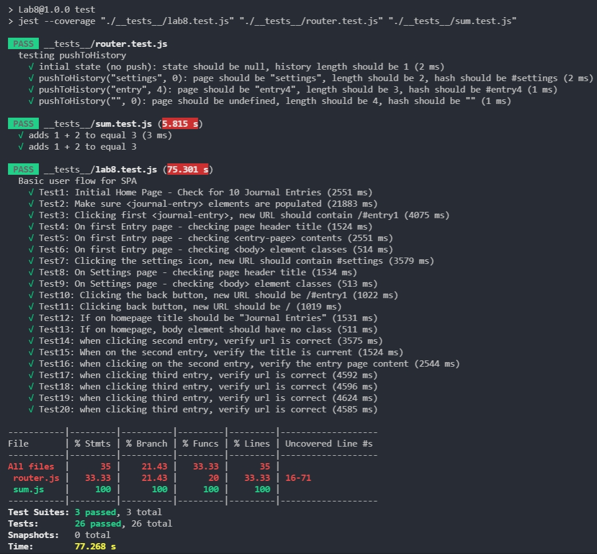

# Lab8_Starter

## Check your understanding q's (FILL OUT)
1. In your own words: Where would you fit your automated tests in your Bujo project development pipeline? (just write the letter)
    - 1 or A: "Within a Github action that runs whenever code is pushed"

2. Would you use a unit test to test the “message” feature of a messaging application? Why or why not? For this question, assume the “message” feature allows a user to write and send a message to another user.
    - No, because unit testing is to test individual components of our code. Testing the "message" feature would be testing more than one part of our code (writing and sending).

3. Would you use a unit test to test the “max message length” feature of a messaging application? Why or why not? For this question, assume the “max message length” feature prevents the user from typing more than 80 characters
    - Yes, max message length is a small enough component of our program that we can test individually.

4. What do you expect to happen if we run our puppeteer tests with the field “headless” set to true?
    - It will run the tests without a browser UI.

5. What would your beforeAll callback look like if you wanted to start from the settings page before every test case?
    - The page would need to click on settings icon at the top right, since you cannot access the page directly using goto (it's not a separate webpage).

## Authors
- Matthew Jiang
- Anudeep Alam
- Kunal Singla

